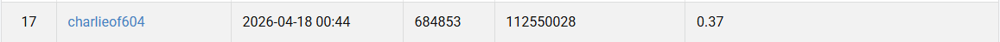

# Image Classification with ResNet

## Introduction

The goal of this task is to detect digits in RGB images by predicting both their class labels (0–9) and bounding boxes. The dataset is provided in COCO format, and performance is evaluated using standard object detection metrics such as Average Precision (AP). In this work, we adopt DETR with a ResNet-50 backbone. DETR formulates object detection as a set prediction problem, eliminating the need for hand-crafted components such as anchor boxes and non-maximum suppression (NMS).

---

## Environment Setup

### 1. Install Dependencies

- pip install -r requirements.txt

## Usage

### Training

- How to train my model

- python train.py <--init_mode scratch(starting from DETR)/best(starting from best saved model)> <--epoch N>

### Inference

- How to obtain results for test

- Train once to get the weights that infer.py needs

- python infer.py

### Performance Snapshot

